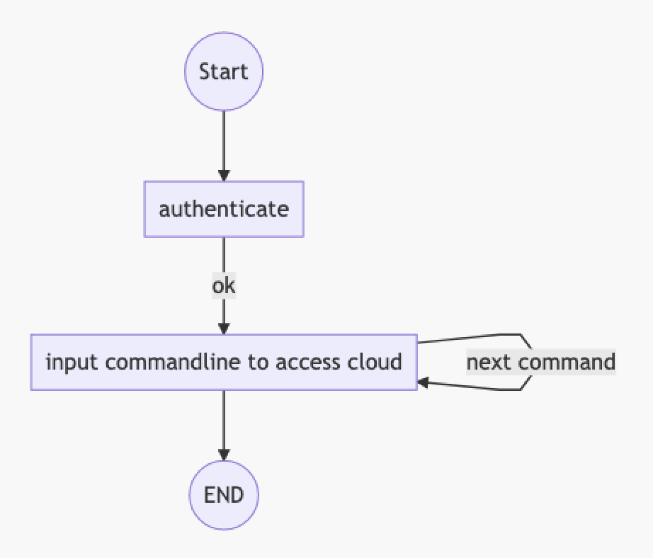
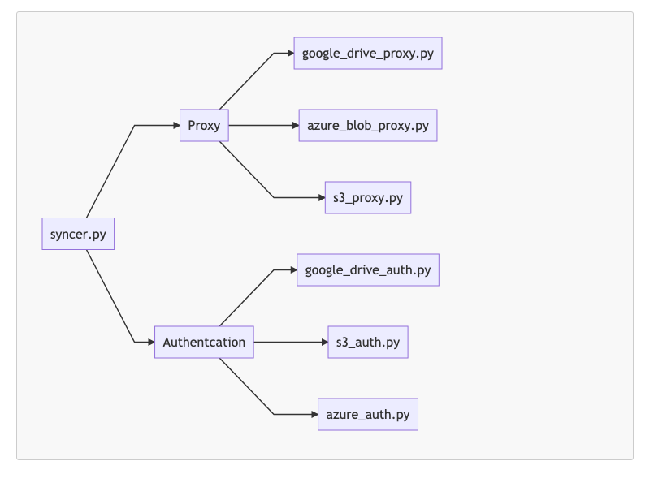
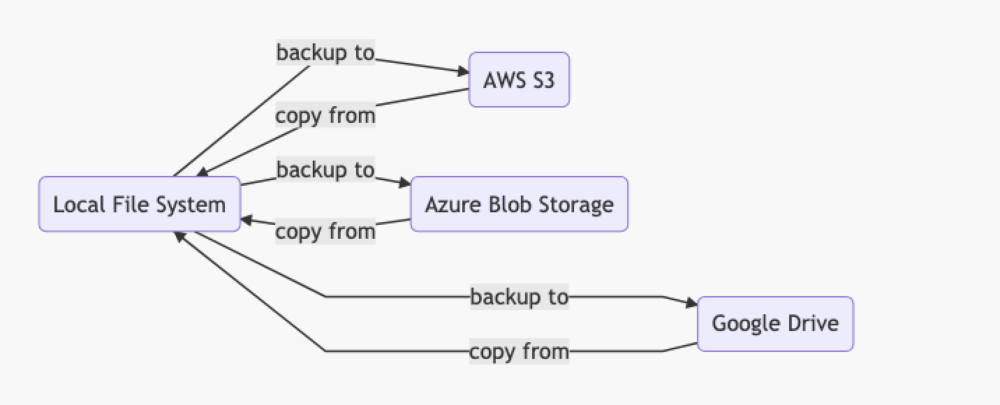

# Syncer:  A Tool for File BackUp Leveraging Multiple Cloud Storages

Group Member: Wenbin Huang

NetID: vx3255

Course: CS623 Cloud Computing 

Source Code in Github: [https://github.com/wenbinhuang9/syncer](https://github.com/wenbinhuang9/syncer)

# Introduction 

Document backup is very important because storage hardwares , such as disk, HDD, SSD, has a potential risk of corruption. Traditionally, we usually buy disk drive for backup, so we have to maintain hardwares, which is costly and time consuming. Currently, we can leverage multiple cloud storages to enable backup without maintaining the hardware. Further, backup on the cloud is safe, cheap and also easy. So, in this project, I will leverage Azure Blob Storage, AWS S3 and Google Drive to provide unified interfaces to access back up service on cloud. 

# Architecture, Orchestration Model And Flow Diagram
 
## Architecture 


The above picture is the layered architecture of my project. There are three modules Proxy, Authentation and Commandline Interface. 

### Commandline Interface

The project provides unified APIs to access multiple cloud storages to reduce learning curve and complexity. The APIs is easy to use because it is compatible with Linux File System Commandline. The following is examples of API, which copys local file to different clouds. 

```shell
syncer cp ./hello.txt s3
syncer cp ./hello.txt gdrive
syncer cp ./hello.txt az
```

### Proxy 

Proxy encapsulates functionality from different cloud storages, providing unified APIs for Commandline Interface Module to access.

### Authentication 

Each cloud has its own authentication way, so I have to encapsulates Authentication Module to provide unified APIs for Commandline Interface Module to authenticate different cloud storages. 

## Orchestration Model and Flow Diagram



The above picture is the Orchestration Model to use Syncer tool, we just need to authenticate the cloud storage and then we can use commandline interfaces to operate on the cloud. 


# Source Code 

Project is managed by the github, check the following link to view the code. 

Github: [https://github.com/wenbinhuang9/syncer](https://github.com/wenbinhuang9/syncer)

## Code Structure 


The above picture shows the code structure, where syncer.py is the entrance for the code. 

# Database Model and Diagram

The following picture shows the project database model. Local file system either backup data to cloud or copy data from cloud. 



# CommandLine Interfaces 

Authtication
```
syncer login gdrive
syncer login s3
syncer login az
```
List file list on cloud
```
syncer ls gdrive
syncer ls s3
syncer ls az
```
Backup a local directory or file to cloud 
```
syncer cp ./testfile gdrive
syncer cp ./hello.txt s3
syncer cp ./hello.txt az
```
Copy from cloud to local 
```
syncer cp s3/hello.txt ./
syncer cp gdrive/{fileid} ./
syncer cp az/world.txt ./
```
Delete a directory  
```
syncer rm gdrive/{fileid}
syncer rm s3/hello.txt
syncer rm az/world.txt 
```

# Clouds and Technologies Used 

## Cloud used 
1. AWS S3 and IAM 
2. Azure Blob Storage and IAM
3. Google Drive and IAM 
   
## Programming Languages 

- Python 3.0 and Python Unittest Framework

## Libraries Used 
1. **AWS CLI** to access  S3 
2. **Azure azcopy CLI** to access Azure Blob Storage
3. **PyDrive API** to access Google Drive  


# Environment Required and Deployment 

## Environment and Libraries Required
- OS: OSX(Apple MAC)
- Python3.0 
- [azcopy](https://docs.microsoft.com/en-us/azure/storage/common/storage-ref-azcopy-copy) 
- [Pydrive](https://github.com/googleworkspace/PyDrive)
- [aws-cli](https://github.com/aws/aws-cli)


## Deployment Instructions

1. Install [brew](https://docs.brew.sh/Installation)
2. Install azcopy : `brew install azcopy`
3. Install aws cli: `brew install aws-cli`
4. Install Pydrive: `pip3 install PyDrive`


## Authentication Configuration 
### AWS IAM Configuration 

1. Go to IAM to create user binding with Policy AmazonS3FullAccess
2. Go to user summary page, click `Security credentials` , then click `create access key`
3. Execute `syncer login s3` , and then input accees key, access secrets and S3 bucket name. 

### Azure IAM Configuration 

1. [Find your tenant-id in Azure](https://stackoverflow.com/questions/26384034/how-to-get-the-azure-account-tenant-id) 
2. Execute `azcopy login --tenant-id={your tenant-id}`
3. [Create Azure Blog Storage SAS Token](https://adamtheautomator.com/azure-sas-token/)
4. Execute `syncer login az`, input your sas token here  

### Google Drive  Configuration 

1. [Click to view how to configure authentication for Google drive](https://pythonhosted.org/PyDrive/quickstart.html) 
2. Download the client-secrets.json file and rename to client-secrets.json, then copy to directory same as syncer. 
3. Execute `syncer login gdrive` 


# Conclusion 
In this project , I have provided a simple API to back up local file to cloud storage. Currently , the authentication API is not that friendly, so I will research to find a better authentication way and provide a better authentication API. Other future directions are to support more cloud storages and also to consider encryption for security. 
