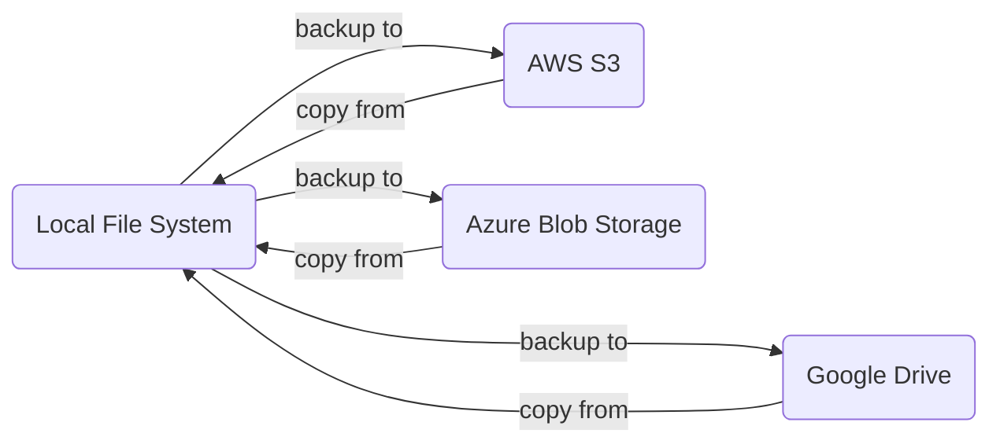

```mermaid
graph LR;
    LS(Local File System) --->|backup to | Gdrive(Google Drive)
    Gdrive -->|copy from| LS
    LS -->|backup to| S3(AWS S3)
    S3 -->|copy from| LS
    LS -->|backup to| az(Azure Blob Storage)
    az -->|copy from| LS

```