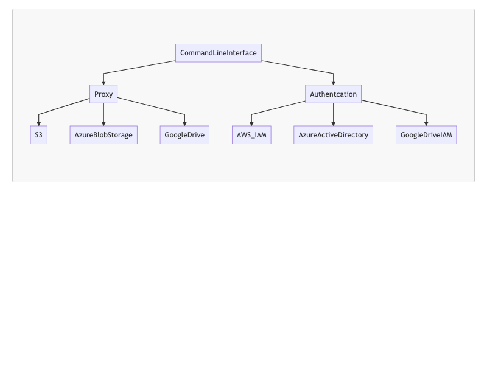

<style>
    h1 {
        text-align:center ;
    }
    h2 {
        text-align:center; 
    }
        h3 {
        text-align:center; 
    }
    body{
        font-size:20px;
    }

</style>

# Syncer

<style>
    h4 {
        text-align: center
    }
</style>

## A Tool for Local File BackUp Leveraging Multiple Cloud Storages


<br>
<br>

####  Group Member: Wenbin Huang 

#### NetID: vx3255 

#### Course: Cloud Computing

#### Github Link for Project: https://github.com/wenbinhuang9/syncer

---

# What is the problem 

<br>
<br>


- **Document Loss**:  document may loss if we don't backup
  <br>
- **High Cost**: It takes money to buy and maintain hardware drives for backup, and hardware drive is unstable with time going.
  
  <br>
- **Learning Curve** is high if we want to use multiple cloud storage such as Google Drive, AWS S3, Azure Blog Storage etc. 
  
   

---

# How to Address the Problem 

- **Backup**: Leveraging multiple cloud storage for backup 
<br>
- **Clouds are Cheap**: Clouds provide limited free storage and are cheap if we need more   

<br>

- **Simple and Unified API to Reduce Learning Curve**: The API for backup is simple and compatible with **Unix File Operation Command Line**

---
<style>
    h2 {
        text-align: left
    }
</style>

# My Contribution 

## Searching:
- search the storage service provided by Google Drive, Azure and AWS 
- How to use cloud IAM to implement authentication
- How to use API to access cloud storage

## Coding 
- Develop proxy, authentication, API and configuration module 

## Testing
- Code full unittests 

---

# Cloud Services Used

<br>

- AWS S3 and IAM 
<br>
- Azure Blob Storage and IAM
<br>
- Google Drive and IAM 
<br>

---
# Languages and Libraries Used 

- Python 3.0 and Python Unittest Framework

<br>

- **AWS CLI API** to access  S3 

<br>

- **Azure azcopy API** to access Azure Blob Storage

  <br>

- **PyDrive API** to access Google Drive  
---

# Architecture 





---
# Development Method: Test Driven Development

**Python unittest** to provide full unit test .

Unit Test Code Demo  

Run Unit Test Command: python3 test_azure_copy_proxy.py
```python
import os 
import unittest
import syncer
class TestSyncer(unittest.TestCase):

    def test_parse_cloud_dir(self):
        cloudDir = "s3"
        cloud, dir = syncer.parseCloudDirectory(cloudDir) 

        self.assertTrue(cloud == "s3")
        self.assertTrue(dir == "./")

if __name__ == '__main__':
    unittest.main()

```


---
# Google Drive BackUp Demo Show
Authtication
```
syncer login gdrive
```
List file list under Google Drive Root Directory
```
syncer ls gdrive
```
Backup a directory 
```
syncer cp ./testfile gdrive
```
Delete a directory  
```
syncer cp ./testfile gdrive
syncer rm gdrive/{fileid}
```
---

# AWS S3 BackUp Demo Show
Authtication
```
syncer login s3
```
List file list under S3 Root Directory
```
syncer ls s3
```
Backup a directory 
```
syncer cp ./testfile s3
```
Copy from cloud to local  
```
syncer cp s3/folder ./
```
---
# Azure Blob Storage Demo Show
Authtication
```
azcopy login --tenant-id=19a46ac2-a14b-4dfa-bce3-93965c21f4cf
syncer login az 
```
List file list under S3 Root Directory
```
syncer ls az 
```
Backup a directory 
```
syncer cp ./testfile az
```
Copy from cloud to local  
```
syncer cp s3/testfile ./
```
--- 

# Future Improvements 

<br>

- **Confidentiality**: Using encrypted algorithms like AES .
<br>
- **Cross Platform**: Make Tool supported under Windows 
  <br>
- **More Cloud Storage**: Support More Cloud Storage such as dropbox, Baidu Drive


---
# Thank you  for your time and patience 

