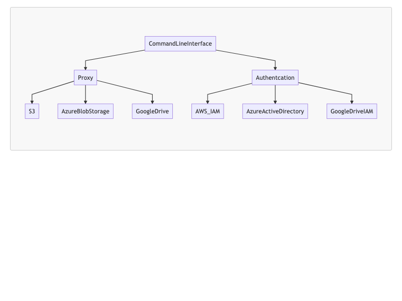

<style>
    h1 {
        text-align:center ;
    }
    h2 {
        text-align:center; 
    }
    body{
        font-size:20px;
    }

</style>

# Project: A Local File System Sync to Cloud Storage 


## Group Member: Wenbin Huang 

## NetID: vx3255 

## Course: Cloud Computing

---

# What is the problem 

- Our local file system may have important documents, it is necessary to backup it in a convenient way. 
- Further, we can leverage cloud storage with other cloud services to provide personal blog services simply based on local file system. 

---

# How to address the problem 

- We can leverage multiple cloud platforms to provide storage functionality for local file system such as AWS S3, Azure Blob Storage.


- And we also need authentication services, so we can use authentication service from AWS IAM and Azure Active Directory 


- We can also provide static blog service based on AWS S3  


---

# My Contribution 
- Lead the project 
- Research on the AWS S3, Boto3 API for S3, AWS AMI service, Azure Blob Storage and Azure active direcotry service 
- Coding and testing 


---

# Cloud Services Used in the project 

- AWS S3 used for local file system backup storage 
- AWS IAM used for authentication service to access S3
- Azure Blob Storage used for local file system back up storage 
- Azure activec directory used for authentication service to access Azure Blob Storage. 

---
# Programming languages Used in the project 

- Base on Python 3.0 
- Provide commandline interface for simple use
- Using Boto3 API provided by AWS to access S3.
- Using Python Unittest framework to test the function. 

---

# Architecture 





---

# Development Method: Test Driven Development

- Based on Python UnitTest framework to provide full unit test .


The following is one of unit test case . 

```python
    def test_sync_dir_command(self):
        dir = "./image"
        template = "aws s3 sync {0} s3://spencer.file.sync/{1}"

        result = template.format(dir, dir[2:])

        command = s3_proxy.genDirFileCommand(dir)

        print(command)

        self.assertEqual(command, result)
```


---
# Demo Show 
- Synchronize a local direcory to S3
```

```
- Synchronize a single file to S3 
```
```
- Delete a single file from S3
```
```
- BackUp directory from S3 to local file system 
```
```
- A Static Blob Deployment based on my project tool 
```
```
---

# Future Improvements 

- Security: add encryption and decryption function to provide confidentiality.
- Support more cloud or application platforms such as Google Cloud Platform,  Google Drive and Dropbox. 


---
# Thank you  for your time and patience 

